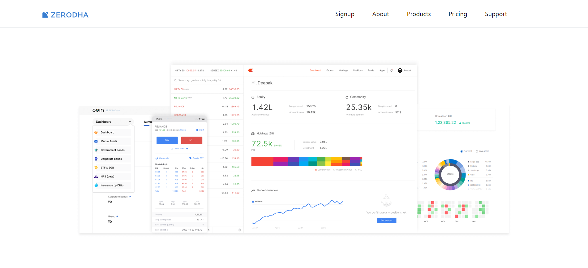
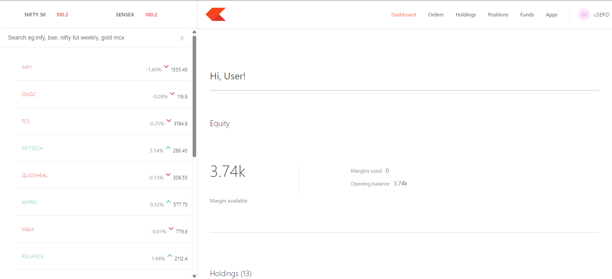

# Zerodha – Full Stack Trading Dashboard Clone

         

A full-stack Zerodha trading dashboard clone built using modern web technologies. This project replicates core features of portfolio tracking such as holdings, positions, orders, charts, and real-time-like UI updates.

## Tech Stack

**Frontend**

- React.js
- Bootstrap
- Material UI
- Chart.js

**Backend**

- Node.js
- Express.js

**Database**

- MongoDB

## Features

**Dashboard**

- View complete portfolio in a clean UI
- Equity summary, current value, investment value
- Holdings table with P&L, day change, average price, quantity, etc.
- Positions page
- Order placement (demo)

**Backend API**

- Restful API for:
  - Retrieving holdings (`/allHoldings`)
  - Retrieving positions (`/allPositions`)
  - Creating new orders (`/newOrder`)

**Data Visualization**

- Chart.js line, bar, and doughnut charts for analyzing portfolio performance.

**Responsive UI**

- Fully responsive and styled using Bootstrap + Material UI
- Inspired by Zerodha’s minimalistic design principles

## Project Structure

```pgsql
Zerodha/
│── backend/
│   ├── model/
│   ├── schemas/
│   ├── index.js
│   ├── package.json
│── dashboard/ (React.js)
│   ├── src/
│   ├── public/
│── frontend/ (Landing Page + Main UI)
│   ├── src/
│   ├── public/
│── package.json
```

## Installation & Setup

**Clone the repository**

```bash
git clone https://github.com/your-username/zerodha.git
cd zerodha
```

**Backend Setup (Node + Express)**

```bash
cd backend
npm install
```

Create a `.env` file:

```bash
MONGO_URL=your_mongodb_atlas_url
PORT=4000
```

Start the server

```bash
npm start
```

## Frontend Setup (React + MUI + Bootstrap)

**Frontend landing page**

```bash
cd frontend
npm install
npm start
```

**Dashboard (Trading UI App)**

```bash
cd dashboard
npm install
npm start
```

## API Endpoints

| Method | Endpoint        | Description          |
| ------ | --------------- | -------------------- |
| GET    | `/allHoldings`  | Get all holdings     |
| GET    | `/allPositions` | Get all positions    |
| POST   | `/newOrder`     | Add a new demo order |

## Additional Libraries Used

**Chart.js**
Used for creating interactive and responsive charts in the dashboard.

## Deployment

- Backend deployed on: Render
- Frontend & Dashboard deployed on: Vercel
- Database hosted on MongoDB Atlas

## Screenshots

**Landing Page**



**Trading UI App (Dashboard)**



## Contributing

Contributions are welcome!
Fork this repo and submit a PR with improvements or new features.
